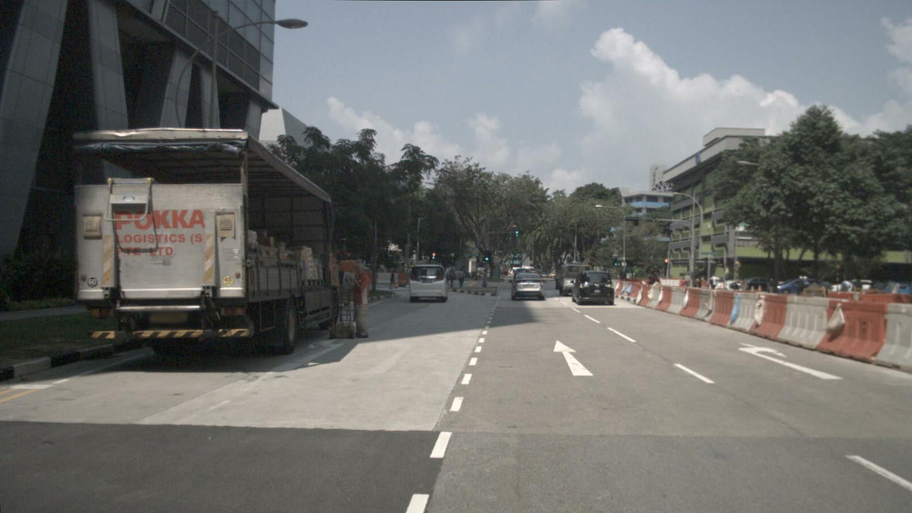

# BEVFormer

## Input



(nuScenes surround-view camera image)

- Input shape: (1, 6, 3, 480, 800) — 6 surround-view cameras, RGB
- Range: normalized with ImageNet mean=[123.675, 116.28, 103.53], std=[58.395, 57.12, 57.375]
- Cameras: CAM_FRONT, CAM_FRONT_LEFT, CAM_FRONT_RIGHT, CAM_BACK, CAM_BACK_LEFT, CAM_BACK_RIGHT

BEVFormer takes multi-camera surround-view images (6 cameras: front, front-left, front-right, back, back-left, back-right) and generates a unified Bird's-Eye-View (BEV) representation for 3D object detection.

## Output


The model outputs 3D bounding boxes in Bird's Eye View with:
- 10 object classes: car, truck, construction_vehicle, bus, trailer, barrier, motorcycle, bicycle, pedestrian, traffic_cone
- Each detection includes: 3D center (x, y, z), dimensions (w, l, h), heading angle, velocity (vx, vy), and confidence score
- Detection range: [-51.2m, 51.2m] in both X and Y axes

## Usage

### Step 1: Export the ONNX model

The model uses Deformable Attention implemented with `F.grid_sample` (standard PyTorch/ONNX operator).

```bash
$ pip install torch torchvision onnx onnxscript onnxruntime
$ cd export
$ python3 bevformer_onnx_export.py --verify
```

This downloads `bevformer_tiny_epoch_24.pth` pretrained weights, exports `bevformer_tiny.onnx` to the parent directory, and verifies it with ONNX Runtime.

### Step 2: Run inference

With ONNX Runtime:
```bash
$ python3 bevformer.py --onnx
```

With ailia SDK:
```bash
$ python3 bevformer.py
```

To specify 6 surround-view camera images, provide them in order after the `--input` option:
```bash
$ python3 bevformer.py --onnx --input CAM_FRONT.jpg CAM_FRONT_LEFT.jpg CAM_FRONT_RIGHT.jpg CAM_BACK.jpg CAM_BACK_LEFT.jpg CAM_BACK_RIGHT.jpg
```

If only 1 image is provided, it will be replicated to all 6 camera views:
```bash
$ python3 bevformer.py --onnx --input IMAGE_PATH
```

You can use `--savepath` option to change the name of the output file to save.
```bash
$ python3 bevformer.py --onnx --savepath SAVE_IMAGE_PATH
```

By adding the `--video` option, you can input the video.
If you pass `0` as an argument to VIDEO_PATH, you can use the webcam input.
```bash
$ python3 bevformer.py --onnx --video VIDEO_PATH
```

You can set the detection confidence threshold with `-th`:
```bash
$ python3 bevformer.py --onnx -th 0.4
```

To output detection results as JSON:
```bash
$ python3 bevformer.py --onnx -w
```

## ONNX Export Details

### Deformable Attention

BEVFormer's Multi-Scale Deformable Attention (from Deformable DETR) uses a
CUDA custom operator in the original mmcv implementation. This project replaces
it with a pure-PyTorch implementation using `F.grid_sample`, which is supported
as a standard ONNX operator (opset >= 16).

See `export/deformable_attention.py` for the implementation.

### Export options

```bash
$ cd export

# Default: 480x800 input, 6 cameras, opset 18
$ python3 bevformer_onnx_export.py

# Custom resolution
$ python3 bevformer_onnx_export.py --img_h 480 --img_w 800

# Export and verify with ONNX Runtime
$ python3 bevformer_onnx_export.py --verify
```

### ONNX Runtime verification results

```
Model inputs:
  images: [1, 6, 3, 480, 800]
Model outputs:
  cls_scores: [1, 900, 10]
  bbox_preds: [1, 900, 10]

cls_scores max diff:  0.000017
bbox_preds max diff:  0.000053
PASSED (tolerance=0.001)
Average inference time: ~671 ms (CPU)
```

## Architecture

BEVFormer-tiny uses a spatiotemporal transformer architecture:

1. **Image Backbone**: ResNet-50 + FPN (multi-scale features at stride 8, 16, 32)
2. **BEV Encoder**: 3 transformer encoder layers with:
   - Self-attention on BEV queries (50x50 grid)
   - Deformable cross-attention to multi-scale image features (via `F.grid_sample`)
   - Feed-forward network
3. **Detection Head**: Transformer decoder (6 layers) with 900 object queries
   - Classification head (10 nuScenes classes)
   - Regression head (cx, cy, cz, w, l, h, sin, cos, vx, vy)

Parameters: ~33.5M (pretrained on nuScenes)

## File Structure

| File | Description |
|------|-------------|
| `bevformer.py` | Main inference script (ONNX Runtime / ailia) |
| `export/bevformer_model.py` | BEVFormer-tiny model definition (pure PyTorch) |
| `export/bevformer_onnx_export.py` | ONNX export script with verification |
| `export/deformable_attention.py` | Multi-Scale Deformable Attention (grid_sample-based) |

## Reference

- [BEVFormer: Learning Bird's-Eye-View Representation from Multi-Camera Images via Spatiotemporal Transformers](https://github.com/fundamentalvision/BEVFormer)
- [Paper (ECCV 2022)](https://arxiv.org/abs/2203.17270)
- [BEVFormer_tensorrt (TensorRT deployment)](https://github.com/DerryHub/BEVFormer_tensorrt)

## Framework

Pytorch

## Model Format

ONNX opset=18

## Netron

[bevformer_tiny.onnx.prototxt](https://netron.app/?url=https://storage.googleapis.com/ailia-models/bevformer/bevformer_tiny.onnx.prototxt)
