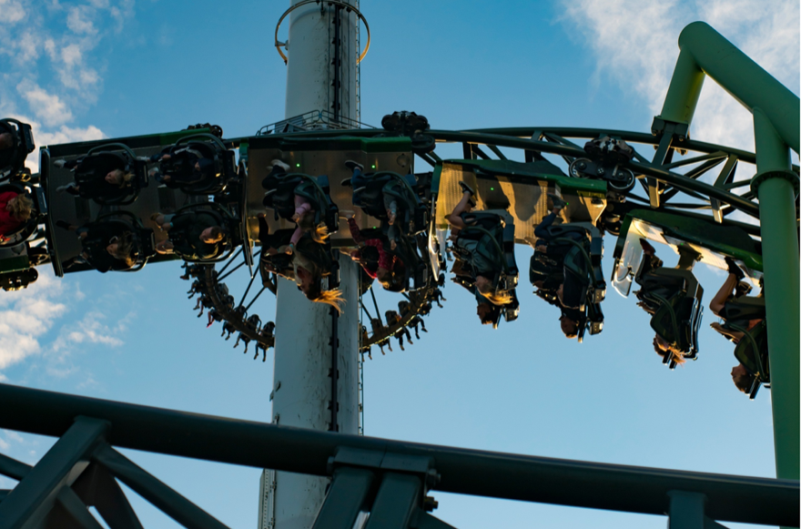
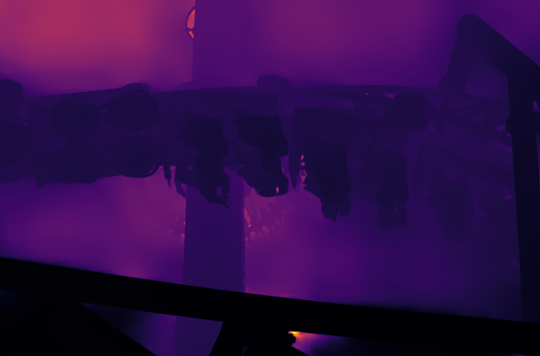

# Depth Pro

## Input

* **Image or Video**



The script will perform a sharp monocular metric depth estimation on the input media.

## Output

* **Depth image**



Estimated metric depth with inferno colormap(without option ```-g```),
or single channel grey scale image(with option ```-g```).

Saves to ```./output.png``` by default but it can be specified with the ```-s``` option

## Usage
Internet connection is required when running the script for the first time,
as it will download the necessary model files.

Running this script will estimate the metric depth of the input image/video.
The results will be shown in a separate window(when inferencing on video),
or saved as an image(when inferencing on image).

#### Example 1: Inference on prepared demo image.
```bash
$ python3 depth_pro.py
```
The result will be saved to ```output.png``` by default.

#### Example 2: Specify input path and save path.
```bash
$ python3 depth_pro.py -i input.png -s output.png
```
```-i```, ```-s``` options can be used to specify the
input path and save path separately.

#### Example 3: Inference on Video.
```bash
$ python3 depth_pro.py -v 0
```
argument after the ```-v``` option can be the device id of the webcam,
or the path to the input video.

## Requirements

This model requires ailia SDK 1.2.16 and later.

## Reference

* [Depth Pro: Sharp Monocular Metric Depth in Less Than a Second](https://github.com/apple/ml-depth-pro)

## Framework

Pytorch

## Model Format

ONNX opset=18

## Netron

[depth_pro.onnx.prototxt](https://netron.app/?url=https://storage.googleapis.com/ailia-models/depth_pro/depth_pro.onnx.prototxt)
