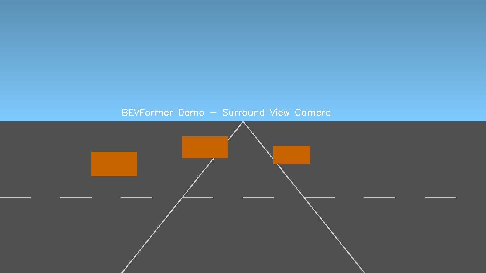
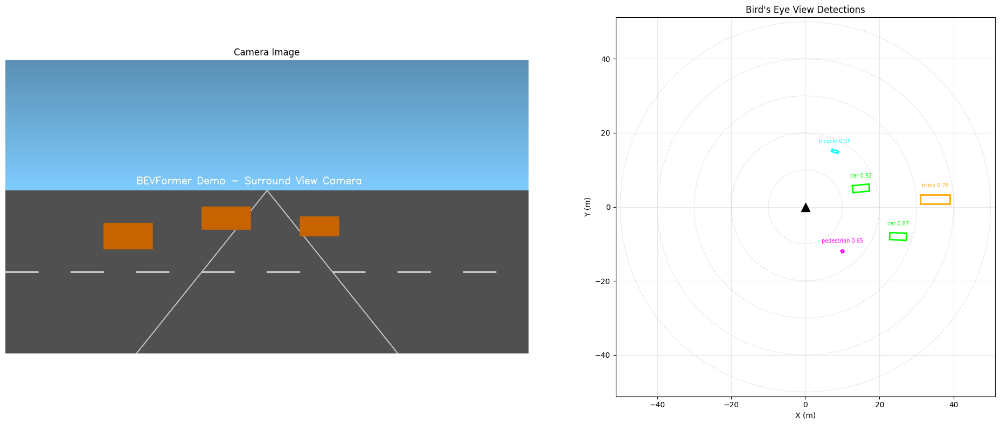

# BEVFormer

## Input



(Image from nuScenes dataset)

- BEVFormer-tiny backbone input shape: (1, 3, 928, 1600)
- Range: normalized with ImageNet mean=[123.675, 116.28, 103.53], std=[58.395, 57.12, 57.375]
- Channel order: RGB

BEVFormer takes multi-camera surround-view images (6 cameras: front, front-left, front-right, back, back-left, back-right) and generates a unified Bird's-Eye-View representation for 3D object detection.

## Output



The model outputs 3D bounding boxes in Bird's Eye View with:
- 10 object classes: car, truck, construction_vehicle, bus, trailer, barrier, motorcycle, bicycle, pedestrian, traffic_cone
- Each detection includes: 3D center (x, y, z), dimensions (w, l, h), heading angle, velocity (vx, vy), and confidence score
- Detection range: [-51.2m, 51.2m] in both X and Y axes

## Usage

Automatically downloads the onnx and prototxt files on the first run.
It is necessary to be connected to the Internet while downloading.

For the sample image,
```bash
$ python3 bevformer.py
```

If you want to specify the input image, put the image path after the `--input` option.
You can use `--savepath` option to change the name of the output file to save.
```bash
$ python3 bevformer.py --input IMAGE_PATH --savepath SAVE_IMAGE_PATH
```

By adding the `--video` option, you can input the video.
If you pass `0` as an argument to VIDEO_PATH, you can use the webcam input.
```bash
$ python3 bevformer.py --video VIDEO_PATH
```

You can set the detection confidence threshold with `-th`:
```bash
$ python3 bevformer.py -th 0.4
```

To output detection results as JSON:
```bash
$ python3 bevformer.py -w
```

## ONNX Model Export

To export the BEVFormer-tiny model from PyTorch to ONNX, use the provided export script.

### Prerequisites

```bash
pip install torch torchvision
pip install mmcv-full==1.5.0 mmdet==2.25.1 mmdet3d==1.0.0rc4
git clone https://github.com/fundamentalvision/BEVFormer.git
```

### Export with pretrained weights

```bash
python3 bevformer_onnx_export.py \
    --config BEVFormer/projects/configs/bevformer/bevformer_tiny.py \
    --checkpoint bevformer_tiny_epoch_24.pth \
    --output bevformer_tiny_backbone.onnx \
    --export-head
```

### Export backbone only (without mmdet3d)

If mmdet3d is not available, the script can export a standalone ResNet50+FPN backbone:
```bash
python3 bevformer_onnx_export.py --output bevformer_tiny_backbone.onnx --export-head
```

## Architecture

BEVFormer uses a spatiotemporal transformer architecture:

1. **Image Backbone**: ResNet-50 (tiny) or ResNet-101-DCN (base/small) with FPN neck
2. **BEV Encoder**: Transformer encoder with spatial cross-attention and temporal self-attention
3. **Detection Head**: Deformable-DETR-based decoder with 900 object queries

The tiny variant uses:
- 3 encoder layers (vs 6 for base)
- 50x50 BEV grid (vs 200x200 for base)
- ResNet-50 backbone without deformable convolutions

## Reference

- [BEVFormer: Learning Bird's-Eye-View Representation from Multi-Camera Images via Spatiotemporal Transformers](https://github.com/fundamentalvision/BEVFormer)
- [Paper (ECCV 2022)](https://arxiv.org/abs/2203.17270)
- [BEVFormer_tensorrt (TensorRT deployment)](https://github.com/DerryHub/BEVFormer_tensorrt)

## Framework

Pytorch

## Model Format

ONNX opset=11

## Netron

[bevformer_tiny_backbone.onnx.prototxt](https://netron.app/?url=https://storage.googleapis.com/ailia-models/bevformer/bevformer_tiny_backbone.onnx.prototxt)

[bevformer_tiny_head.onnx.prototxt](https://netron.app/?url=https://storage.googleapis.com/ailia-models/bevformer/bevformer_tiny_head.onnx.prototxt)
