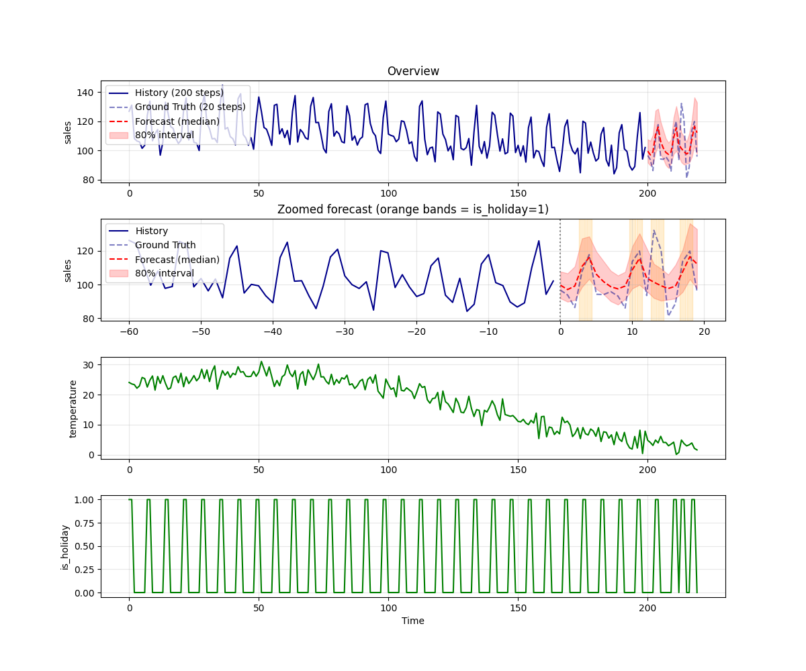

# Moirai

Moirai (Salesforce uni2ts) is a Universal Time Series Transformer that supports
zero-shot forecasting and accepts known-future covariates (`feat_dynamic_real`).
This makes it suitable for use cases where exogenous signals such as temperature
or holidays influence the target series.

## Input
A CSV file containing a `date` column, one target column, and (optionally)
extra covariate columns whose future values are known.

The default `input.csv` is a synthetic convenience-store (konbini) sales
example with `sales`, `temperature`, and `is_holiday` columns:

```
        date       sales  temperature  is_holiday
2023-01-01  111.936281     4.100060           1
2023-01-02  120.335880     2.804389           1
2023-01-03  117.991534     4.354113           1
...
```

## Output



The forecast plot shows historical observations (solid blue), the held-out
ground truth (dashed blue), the median forecast (red dashed) and the 80%
prediction interval shaded in red. When covariates are provided, their values
are plotted in the lower panels.

## Usage
Automatically downloads the onnx and prototxt files on the first run.
It is necessary to be connected to the Internet while downloading.

```bash
$ python3 moirai.py
```

A target column and (optional) covariate columns may be specified. To replicate
the konbini example from
[issue #1854](https://github.com/ailia-ai/ailia-models/issues/1854):

```bash
$ python3 moirai.py --target sales --feat temperature,is_holiday --patch_size 16
```

You can switch between the three publicly released Moirai-1.1-R sizes (each
corresponds to a separate ONNX file):

```bash
$ python3 moirai.py --size small   # default, 54 MB
$ python3 moirai.py --size base    # 350 MB
$ python3 moirai.py --size large   # 1.2 GB
```

The forecast horizon and the size of the past context window are configurable
with `--prediction_len` and `--context_len`. The Moirai patch size can either
be selected automatically by Moirai (`--patch_size auto`, the default) or fixed
to one of `8`, `16`, `32`, `64`, `128`:

```bash
$ python3 moirai.py --context_len 512 --prediction_len 64 --patch_size 32
```

The probabilistic forecast is built from `--num_samples` samples drawn from the
predictive mixture distribution; a larger value gives smoother quantile
estimates at the cost of inference time:

```bash
$ python3 moirai.py --num_samples 200 --seed 0
```

By default the ailia SDK is used. Pass `--onnx` to use ONNX Runtime instead.

### Choosing `--patch_size` when using covariates

Moirai compresses every `patch_size` consecutive timesteps of each variable
(target *and* `feat_dynamic_real`) into a single transformer token. If
`patch_size` is too large, day-level covariate spikes (e.g. `is_holiday=1`
on Dec 24-25) get averaged inside one token and the model can no longer
condition the forecast on them.

The default `--patch_size auto` picks the patch size that minimises the
**past-window** validation loss; this is *not* always the best patch size
for **utilising future covariates**. For the konbini example above we
measured the median forecast gap between holiday and non-holiday days in the
forecast horizon:

| size  | auto  | p=8  | **p=16**  | p=32 | p=64 |
|------:|------:|-----:|----------:|-----:|-----:|
| small | +0.40 | -0.39 | **+8.54** | +7.40 | -0.65 |
| base  | +0.86 | +0.16 | **+5.68** | +2.30 | -0.53 |
| large | -1.07 | +0.02 | **+10.52**| +4.23 | -1.10 |

(reference observed gap in the context window: +22.34)

Three takeaways:
1. **Pick `--patch_size 16` (or 32) explicitly when you rely on
   `feat_dynamic_real`.** `auto` mode tends to under-utilise the covariate.
2. **Bigger model size does not reliably help.** `large` only gives a small
   bump over `small` at the same patch size, and is no better than `small`
   under `auto`.
3. **Choose `prediction_len` close to a multiple of the patch size** so the
   forecast horizon is not split across half-empty patches.

## Reference

- [Salesforce uni2ts](https://github.com/SalesforceAIResearch/uni2ts)
- [Moirai paper (arXiv:2402.02592)](https://arxiv.org/abs/2402.02592)
- [Hugging Face: Moirai-1.1-R collection](https://huggingface.co/collections/Salesforce/moirai-r-models-65c8d3a94c51428c300e0742)

## Framework

PyTorch + uni2ts (Apache-2.0)

## Model Format

ONNX opset = 17

## Netron

[moirai-1.1-R-small.onnx.prototxt](https://netron.app/?url=https://storage.googleapis.com/ailia-models/moirai/moirai-1.1-R-small.onnx.prototxt)

[moirai-1.1-R-base.onnx.prototxt](https://netron.app/?url=https://storage.googleapis.com/ailia-models/moirai/moirai-1.1-R-base.onnx.prototxt)

[moirai-1.1-R-large.onnx.prototxt](https://netron.app/?url=https://storage.googleapis.com/ailia-models/moirai/moirai-1.1-R-large.onnx.prototxt)

## Notes

The exported ONNX graph corresponds to Moirai's transformer encoder and the
distribution-parameter projection. The pre-processing (target/covariate
patching, time index generation) and post-processing (mixture sampling,
de-patching of the forecast) are performed in Python through the
[`uni2ts`](https://github.com/SalesforceAIResearch/uni2ts) and
[`gluonts`](https://github.com/awslabs/gluonts) libraries, which are therefore
required at inference time:

```bash
$ pip install uni2ts gluonts
```

The ONNX file does not contain the model weights for the HuggingFace
`MoiraiModule` constructor; the inference script downloads the `config.json`
of the matching repository (e.g. `Salesforce/moirai-1.1-R-small`) so that
the distribution-output object can be reconstructed.

## Re-exporting the model

If you want to regenerate the ONNX file (for example after upgrading uni2ts),
use the script under `export/`:

```bash
$ cd export
$ python3 export_moirai.py --size small  --output_dir ..
$ python3 export_moirai.py --size base   --output_dir ..
$ python3 export_moirai.py --size large  --output_dir ..
$ python3 onnx2prototxt.py ../moirai-1.1-R-small.onnx ../moirai-1.1-R-base.onnx ../moirai-1.1-R-large.onnx
```
